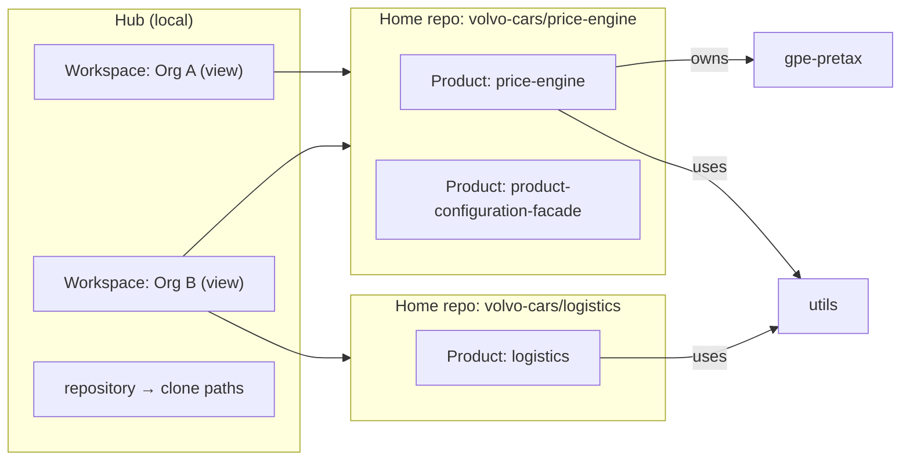

# Workspaces, products and catalogs

Status: **proposal**. This document describes a target model and its delivery plan. Nothing below is implemented yet unless it is listed under [Current behavior](#current-behavior).

Scope: how Groundwork identifies repositories, products and components, groups them into workspaces, and where scanned catalogs live. **Plans are out of scope** and get their own design pass; [Plans](#plans-parked) records only what that pass starts from.

## How Groundwork is used

The model follows how developers work:

- Clones are arranged however each person likes, often as one flat folder that mixes products and organisations. Folder layout can't be relied on to mean anything.
- People clone the repositories they touch, not whole products. Teammates have different subsets.
- Work happens in one repository at a time, on a branch or worktree, often with an agent whose working directory is that repository.
- Sharing means committing and opening a pull request. Anything that isn't committed to a repository is invisible to the team.
- Shared repositories, such as a `utils` library, have one owning team and many consumers.

So Groundwork defines everything by **repository identity and content**, never by folder location.

## Current behavior

- A `.groundwork/` directory is a *project*. `project.json` holds an ID, a name, an optional domain and the format version. The ID is a random UUID unless `init --id` supplies one, so two developers who initialise independently get IDs that don't match.
- `init` also writes `products/app.json` with the store-local ID `app`.
- Catalog IDs have the form `project/component/kind/entity` (`src/data/catalog-identity.ts`), where the first segment is the project's manifest ID.
- Every component requires a `productId`, and so does every scan result (`src/data/content-schema.ts`, `src/data/scan-schema.ts`). Component `dependsOn` and flow `dependencyIds` hold bare component names, such as `gpe-pretax`.
- `parsePlan()` in `server/format.ts` requires `project.json` and places every product in one synthetic workspace.
- The project concept is ambiguous in practice. `price-engine`'s project is named "Commercial Backbone" and holds two products, `price-engine` and `product-configuration-facade`, so it acts as a workspace. `wordloop-platform`'s project is a single product.
- Workspaces and products also exist in the Hub registry (`~/.config/groundwork-v2/registry.json`) as free-text labels. `productCatalog()` in `server/registry.ts` matches those labels to catalog products by name. Source-only repositories are registered with `projectId: null`; those entries group repositories and also drive checkout and worktree discovery.
- The split catalog layout is detected by the presence of both `project.json` and `.groundwork/catalog/layout.json` (`server/catalog-storage.ts`).
- Scan results are stored in the home that ran the scan, not in the scanned repository. `prepare_repository_scan` copies one commit into a temporary read-only snapshot, agents return evidence pinned to that commit, and `apply_repository_scan` writes the results to the target home's `catalog/components/` with a manifest in `catalog/scans/`. `price-engine` therefore holds the catalog for 11 repositories, and another product using one of them would have to scan it again.
- Plans reference catalog component IDs in `touches`, task `componentId`, API guides and storage tables, and validation fails if those components aren't in the catalog.

## Model



| Concept | What it is | Where it lives |
|---|---|---|
| **Repository** | A Git repository, identified by its `origin` remote | Its own Git history |
| **Home repo** | Any repository whose `.groundwork/` directory holds products (or, later, plans) | The repository itself |
| **Product** | A named set of repositories, or of paths within them | A home repo |
| **Component** | A service, module, store or provider | Its repository's catalog, or its product's home repo for declared components |
| **Catalog** | Scanned knowledge about one repository's components: APIs, data, messaging, flows and findings | The repository itself (**source catalog**), or a home repo (**local catalog**) |
| **Workspace** | A view that groups products | The Hub only |

"Project" disappears. `project.json` is removed at the end of the migration and nothing replaces it.

The catalog is **information, not structure**. It helps people and agents understand code, but nothing else depends on it: products, workspaces and plans are all valid without one.

### Home repositories

A repository's role comes from what its `.groundwork/` directory contains. Any combination is valid:

| Contents | Role | Example |
|---|---|---|
| Its own catalog | Catalogued repository | `gpe-pretax` after a scan |
| Products | Product repo | The home of a multi-repository product |
| Plans | Planning repo | Designed in the plans pass |
| Several of these | All of those roles | A single app, or a monorepo with many products |

A repository with no `.groundwork/` directory is still valid: it is a source repository whose catalog, if any, is kept as a local catalog in a home repo.

For a single repository or a monorepo, the home is that repository. For a product spanning repositories, choose a home that meets these criteria:

- Everyone who maintains the product can open pull requests there.
- Edits to `.groundwork/` don't trigger deployments. Filter CI on `.groundwork/**` if needed.
- It outlives any single service.
- It has a clear owner for reviews, for example through CODEOWNERS on `.groundwork/`.

A documentation or architecture repository usually meets all four. An infrastructure repository fits well when it meets the access and pipeline criteria.

### Identity

IDs are derived only from what every developer sees identically: the repository's remote, folder paths and file contents. Nothing is random, typed by a person, or dependent on one machine's configuration or on scan history. So two developers who set up Groundwork independently, without pushing, get the same IDs, and their files line up when the team adopts it (see [Adopting independent setups](#adopting-independent-setups)).

| Thing | Identity | Example |
|---|---|---|
| Repository | Normalised `origin` remote | `volvo-cars/gpe-pretax` |
| Product | Home repo + product `id` | `volvo-cars/price-engine` + `price-engine` |
| Code component | Its source repository + a local ID derived from its build manifest and folder | `volvo-cars/gpe-pretax` + `pretax-api--src-api` |
| Declared component | Home repo + local ID | `volvo-cars/price-engine` + `postgres` |
| Catalog entry | Repository + component + kind + entity, each URI-encoded | `volvo-cars%2Fgpe-pretax/pretax-api--src-api/endpoint/GET%20%2Fprices` |

**Repository identity** is the clone's `origin` remote, normalised. Remotes that exist only on one machine, such as `upstream` or a Git configuration override, are never consulted, because a teammate's clone wouldn't have them. A fork therefore has its own identity, as it is a separate repository. A clone without `origin` gets a provisional `local:` identity; validation warns, and it is rewritten once `origin` is added.

Normalisation treats every URL form of one repository as the same identity on every host, not only GitHub.com. It parses SCP (`git@host:path`), SSH, HTTPS and `owner/name` shorthand into host and path, then drops credentials, default ports, a trailing `.git` or `/`, and lower-cases the host. GitHub.com repositories become `owner/name`, lower-cased as today; every other host keeps its host, so `ghe.example.com/acme/api` never collides with `acme/api`, and its path case is kept as the host reports it.

**Product IDs** are written once, when the product is created, and never change. `init` derives the first product's ID from the repository name, so two independent `init`s of the same repository write the same ID. The **slug** is a separate display and URL name that can be renamed freely without affecting any reference. `init --id` still allows a chosen ID, but independent setups then only align if both chose the same value.

**Component local IDs** always combine the build manifest's name (`package.json`, `.csproj` and so on, which the scanner already proposes as `suggestedId`) with its normalised folder, for example `api--services-price`. A manifest at the repository root uses its name alone. The ID never depends on whether another component shares the name, so a scan made before a same-named project appeared and a fresh scan after it agree. Applying a scan enforces this derivation for new components.

Rules:

- Components are qualified by **repository, not product**. A shared repository, or one that moves to another product, keeps its component IDs.
- Catalog IDs become `repository/component/kind/entity`, with URI-encoded segments as today.
- Every stored reference to a component or product is structured, for example `{ "repository": "volvo-cars/gpe-pretax", "component": "pretax-api--src-api" }` or `{ "repository": "volvo-cars/price-engine", "product": "price-engine" }`. This covers component `dependsOn` and flow `dependencyIds`. Names containing `/` need no parsing, and the UI can display them as `volvo-cars/price-engine#price-engine`.
- **Scan manifests are the one exception.** A scan is an event, not a shared entity: its manifest's ID is a hash of its whole content, including timestamps, so two scans of the same commit are two records. Nothing references a scan except the provenance of the catalog it produced.
- Collisions are either impossible or ordinary Git conflicts. Two developers creating the same product in the same home both write the same product file.

Identity changes:

- **Renames and transfers.** A product's repository entry lists earlier identities in `aliases`, and the Hub resolves catalogs and references that use an alias. Hosting services also redirect old URLs, so fetches keep working.
- **Renamed or moved build projects.** Derived IDs can't survive a rename or folder move on their own. A new reconciliation operation records a component's old and new local ID and source path in the catalog, and later scans match against it before treating the project as new. `reconcile_catalog`'s existing rename only changes a display name and path, and keeps the ID.

### Adopting independent setups

Two developers may each run `init` and scan in their own clone, without pushing, and later adopt Groundwork as a team. When the second developer pulls the first one's `.groundwork/`, Git refuses because their own untracked files would be overwritten.

`groundwork adopt` resolves this. It sets the local copy aside, pulls the shared one, and merges the local copy into it:

- Documents with the same ID are the same thing. Identical ones merge silently.
- Catalog content follows the same rules as [choosing between catalogs](#which-catalog-a-product-uses), so the scan of the later source revision wins for each area, flow and finding.
- Products that exist on only one side are added. A product with the same ID but different content is shown as a conflict for the developer to resolve.
- The result is an ordinary uncommitted change, reviewed and pushed like any other.

### Format versions

Versioning is defined per document family:

- **Mutable JSON documents**, such as products and components, carry their own `schemaVersion`. Schemas accept each supported version on read and write only the current one.
- **Content-addressed records**, such as scan manifests, keep their existing `version` field and are never rewritten, because rewriting would change their hashes. Readers support every version ever written.
- **A document without a version** is read as the legacy version for its document type, never as the current format.

The loader upgrades older mutable documents in memory, validates the whole home as one snapshot, and persists upgrades with the next guarded write. When a branch created before a format migration is merged afterwards, its older documents are detected and upgraded individually instead of being misread under a folder-level version.

There is no directory-level manifest, version file or index of products. The directory listing is the index, and a separate list would conflict whenever two developers added entries.

Content-addressed records keep their raw bytes so their hashes still verify. A field-aware adapter for each record version then translates the IDs they embed, such as scan manifest scopes and mappings.

**Mixed versions.** Old releases read strict schemas and reject documents they don't know. So teammates on different releases can't safely share a home once new forms are written. Delivery is split accordingly:

1. A release reads both forms but still writes only the legacy ones.
2. New forms are written only after a home is explicitly migrated. Migration reports the minimum Groundwork version that can read the result.
3. The v3 Hub registry is a new file, so the v2 registry stays usable by an older Hub.

### Storage layout

A migrated home has this layout:

```text
.groundwork/
  products/<product-id>.json                 products this home defines
  catalog/                                   this repository's own catalog (source catalog)
    components/<component-id>/…              code components and the home's declared components
    scans/<hash>.json                        scan manifests, which also record retired entity IDs
  local-catalogs/<host>/<path>/              a local catalog for another repository, same shape as catalog/
  plans/                                     unchanged until the plans pass
  legacy-ids.json                            immutable legacy ID map, only in migrated homes
  GUIDE.md, schemas/                         installed agent contract
```

- The directory for a local catalog is the repository's host and path, for example `local-catalogs/github.com/volvo-cars/gpe-pretax/`, so no encoding is needed.
- **Detection:** a home with `project.json` and `catalog/layout.json` is split v1; a home with `project.json` only is legacy; a home without `project.json` is v3.
- Test fixtures cover legacy, split v1, v3, and a branch created before migration that is merged afterwards.

### Products and repositories

A product lists the repositories it **owns** and **uses**. In a monorepo it can own only some paths:

```json
{
  "schemaVersion": 3,
  "id": "price",
  "slug": "price",
  "name": "Price",
  "kind": "service-system",
  "domain": "https://backstage.example.com/catalog/default/system/price",
  "repositories": [
    { "repository": "volvo-cars/platform", "paths": ["services/price", "libs/price-*"], "role": "owned" },
    { "repository": "volvo-cars/utils", "role": "used", "aliases": ["volvo-cars/common-utils"] }
  ]
}
```

- Code components no longer carry a `productId`. A component belongs to the product whose owned repository and path cover its `repo` and `sourcePath`, so a repository can hold its own catalog without inventing a product.
- A product is valid without any catalog. Its repositories and paths are its structure; a catalog only adds what's inside them.
- Overlapping ownership, whether of whole repositories or of paths, is flagged. Within one home this is checked by validation. Across homes it can only be checked among the homes that are loaded, so the Hub and `validate --all` say which homes the check covered.
- A used repository's components come from that repository's catalog and are shown read-only.
- Components that don't live in a repository, such as Postgres, queues or AssemblyAI, remain declared components in the home's catalog, as today, qualified by the home repo.
- Membership is recorded on the product side only. A repository never lists the products that include it.

### Catalogs

There are two kinds of catalog for a repository:

- **Source catalog:** stored in the repository itself, under its own `.groundwork/catalog/`, with the scan manifests that produced it. This is the canonical, shared copy.
- **Local catalog:** your own scan of a repository, stored in your product's home repo under `local-catalogs/` and shared with your team through it. Use it when you can't or don't want to write to the scanned repository.

The source catalog is the default:

- **It is versioned with the code.** The catalog on `main` describes `main`. A pull request that changes an endpoint can update the catalog in the same change, and a freshness check compares revisions within one repository's history.
- **Each repository is scanned once.** Every product that owns or uses the repository can read the same catalog, including shared repositories such as `utils`.
- **The owning team reviews it** alongside their code.

Scanning keeps its current pipeline. The difference is the target. `prepare_repository_scan` records an explicit destination, either the source catalog in a writable clone of the scanned repository or a local catalog in a named home, and `apply_repository_scan` guards and writes that destination. When no writable clone exists, the destination is the local catalog of the home that started the scan. The write is an ordinary uncommitted change that the developer commits and proposes in a pull request. Groundwork never commits or pushes.

A scan observes one committed revision. Uncommitted changes in the scanned clone are excluded, and preparation warns when that clone has them, so a catalog is never committed alongside code it didn't see.

#### Which catalog a product uses

Catalogs are resolved **per product**. For each repository a product owns or uses, Groundwork compares only two candidates: the repository's source catalog and the local catalog in that product's own home repo. Other teams' local catalogs only affect their own products, so a scan in someone else's home never changes what your products show.

**The candidate describing the later source revision wins:**

- **Freshness is judged by source revision, not scan time.** Each catalog area and each flow or finding records the commit it was observed at. If one revision descends from the other in the repository's history, the descendant wins. Scanning an old commit today doesn't make a catalog newer.
- **The choice is made per unit.** Catalog areas (API, data, messaging) are compared as whole areas, because a baseline scan replaces an area as a unit. Flows and findings are compared individually. An entity that only one candidate has is used, unless the winning candidate has explicitly retired it; retirements are recorded, so a newer scan never lets an older one revive a deleted endpoint.
- **The result must be coherent.** After choosing, Groundwork validates references across the chosen units. A flow or finding that references an endpoint, record or message missing from the chosen area is marked **incompatible** with that area's revision and shown as such, never silently combined.
- **The source catalog breaks ties.** At the same revision, the source catalog wins.
- **Squash merges and rewritten history are recognised.** Each scan records the Git tree ID of the paths it covered as well as the commit. If a local catalog's commit was squash-merged or rebased, its tree matches a commit on the default branch, and it is treated as that commit.
- **Diverged revisions are flagged, not guessed.** If neither revision descends from the other and no tree matches, the source catalog is used and the conflict is flagged until a rescan resolves it.
- **Unknown ordering is explicit.** Comparing needs the scanned repository's commit history. The fetch also asks for the exact commits candidates recorded, where the host allows it. If the history still isn't available, for example in a shallow clone or after a force push removed the commit, the source catalog is used and the ordering is shown as unknown.
- **Provenance is visible.** The viewer shows which catalog supplied each area and the revision of the one it didn't use.

A newer local catalog is a signal that the source catalog is behind. The Hub offers to propose the newer areas to the repository by pull request, so the source catalog catches up. Component IDs never change between catalogs, because they are qualified by repository.

#### Which branch is read

- **The home you're editing** is read from its working tree, as today. Groundwork's own writes are uncommitted changes, so each operation must see the previous one, and write guards describe the files actually on disk.
- **Hub views** read other repositories' catalogs and products from each repository's default branch, as committed in the local clone. A developer working on a feature branch still sees other products as they are on `main`.
- **Operations scoped to one checkout**, such as an agent's CLI or MCP calls in a worktree, read that checkout's own catalog from its working tree, so a feature branch that updates its catalog sees its own changes. Other repositories are read from their default branch.
- **Every view shows what it read**, as `repository@branch` with the commit, including which repositories were read from a working tree. Nothing switches branches silently.
- **When a repository has several clones**, the Hub reads the one whose default branch is furthest ahead, and shows when clones disagree.

### Workspaces

A workspace is a view in the Hub that groups products, for example one per organisation.

- A product can appear in several workspaces.
- Workspaces are never parents of products, so reorganising workspaces changes nothing stored in any repository.

### Validation

Each home repo validates on its own, and never requires a catalog.

- A product's repositories are checked for known identities and, when cloned, for existing paths.
- A used repository whose catalog isn't available is shown as not loaded; that isn't an error.
- `validate --all` loads every home the Hub can locate, checks ownership across them, and reports which homes it covered.
- Git can merge two branches cleanly and still produce an invalid home, for example two products claiming the same path or a flow referencing a deleted endpoint. Validation of the merged tree in CI catches this; the guide recommends it for every home.

### Hub

The Hub gathers home repos and knows where each repository is cloned. It owns no shared data.

```json
{
  "version": 3,
  "checkouts": {
    "volvo-cars/price-engine": ["/Users/me/Workspace/price-engine"],
    "volvo-cars/gpe-pretax": ["/Users/me/Workspace/gpe-pretax"]
  },
  "workspaces": [
    {
      "name": "Commercial Backbone",
      "products": [{ "repository": "volvo-cars/price-engine", "product": "price-engine" }]
    }
  ]
}
```

- Home repos are the checkouts that contain products, so they are inferred, not listed.
- Every checkout, including source-only repositories, takes part in checkout and worktree discovery, as registered source-only repositories do today.
- A repository can have several clones. Linked worktrees are still discovered through Git.
- Running Groundwork inside a repository that isn't a home, such as `gpe-pretax`, looks up its remote, finds the product that owns it, and opens that product.
- When a repository isn't cloned, the Hub can fetch **only its `.groundwork/` directory and commit history**, on explicit request. It uses a treeless, sparse fetch of the default branch into a Hub cache, with the developer's own Git credentials, and brings no source files. The history is what catalog comparison needs, including for repositories that only have a local catalog. The cache is read-only, shows when it was fetched, and refreshes only when asked. Its contents are validated as untrusted data, like any catalog. Today the Hub never fetches; this is the one exception, and it never pushes.

### First run

- **`init` in a repository** creates one product whose ID and slug come from the repository name and which owns the whole repository. It asks no questions and doesn't scan. More repositories or paths are added to the product later.
- **Running Groundwork in a clone that already has `.groundwork/`** registers the checkout and opens it. It never asks to initialise again.
- **Having unpushed Groundwork files when the shared ones arrive** is handled by `groundwork adopt`.
- **Adding clones to the Hub** means registering a folder. The Hub lists the Git repositories it finds below it and adds the ones selected. Which product a repository belongs to comes from the homes' product files, never from folder layout.

## Plans (parked)

Plans get their own design pass. It starts from these decisions:

- **Plans point at code, not at the catalog.** A plan references a repository and optionally a path, for example `{ "repository": "volvo-cars/gpe-pretax", "path": "src/api" }`. A plan can be written, validated and delivered without any catalog.
- **The catalog helps build plans.** When one exists, Groundwork shows the catalog entries covering the referenced code, but the plan never stores catalog IDs or copies catalog content.
- **Change detection uses Git.** A plan records the commit of each repository it was written against, and reassessment asks Git whether the referenced paths changed since then. A catalog, when present, can explain what changed.
- Plans live under `.groundwork/plans/` in a home repo, reference other homes one way only, and don't move between homes.

Until that pass, plan documents, their validation and their references to catalog component IDs keep working unchanged. Existing baselines and assessments stay readable through the legacy ID map. Neither `price-engine` nor `wordloop-platform` has any features yet.

## Migration

Migration is an explicit, dry-run-first operation for each home repo, like `migrate_catalog` today. It refuses to run while a recovery journal is pending, because journals record physical paths. Migration is the only thing that writes new document forms. Until a home is migrated, Groundwork reads it through adapters, derives the new model in memory (for example product membership from components' `productId`), and keeps writing the legacy forms, so teammates on older releases aren't affected. The migration becomes available once all the phases that read the new forms have shipped (Phase 6).

- **Catalog IDs.** Legacy IDs are prefixed with the project's manifest ID, and a home's catalog can describe other repositories: `price-engine`'s retained scans cover `gpe-price-event-dispatcher`, among others. So legacy IDs can't simply be read as "this home". Migration writes a legacy ID map to `legacy-ids.json`, built from each component's `repo`, each scan manifest's `repository`, and retained observations, that translates `<manifest-id>/<component>/…` to `<repository>/<component>/…`. On this machine, the 6 scan manifests hold 195 distinct legacy IDs, and every one resolves. The map is immutable once written. Content-addressed records are never rewritten; readers translate their IDs through the map with the field-aware adapter. IDs the map can't resolve are kept unchanged and shown as unresolved rather than guessed.
- **Unqualified references.** Bare component names in `dependsOn` and flow `dependencyIds`, such as `gpe-price`'s references to `gpe-pretax`, become structured `{repository, component}` references. They are resolved while the old catalog still shows which repository each component belongs to. Names that can't be resolved are kept and shown as unresolved.
- **`project.json`.** Its name becomes the repository's display name. Its domain is copied only to the product it describes, confirmed in the dry run: `price-engine`'s domain points at the Price Engine system, not Product Configuration Facade. It and `catalog/layout.json` are removed only in the final phase, after every reader uses derived identity.
- **Products.** Existing IDs and slugs are kept: Word Loop keeps ID `app` and slug `word-loop`, and `price-engine`'s products keep `price-engine` and `product-configuration-facade`. Registry labels such as "Word Loop" or "Price" are never turned into IDs; the dry run lists each label's mapping, for example `Word Loop → ryannel/wordloop-platform#app`, for the user to confirm. Migration writes each product's `repositories` from the components it currently contains, in the same step that removes their `productId`.
- **Local catalogs.** The catalogs `price-engine` holds for other repositories move to `local-catalogs/<host>/<path>/`. Each can later be proposed to its repository by pull request, and component IDs don't change.
- **Component IDs.** Existing local IDs such as `c-price-api` are kept. Only newly scanned components get derived IDs.
- **Hub registry v2 to v3.** Every registered root becomes a checkout, keyed by its remote. Each distinct `workspace` label becomes a workspace containing the products of its home repos. On this machine, 9 registrations become 9 checkouts, of which 2 are homes, and 2 workspaces. The v3 registry is written to a new file and the v2 file is left in place.
- **Agent contract.** Migration refreshes the installed skill and schemas in `.groundwork/GUIDE.md` and `.groundwork/schemas/`, so agents stop sending legacy fields such as `productId`.
- **Transient state.** Catalog cursors and snapshot tokens from before migration are invalidated. Viewer links of the form `/p/<checkoutId>/w/project/…` redirect to the new product routes.

## Execution plan

Each phase leaves Groundwork working and can be released on its own. Until Phase 6, every phase reads both forms and writes only the legacy ones, so teammates on different releases can share a home. Nothing is removed until everything that reads it has moved to its replacement. Plan documents are untouched throughout, apart from keeping their existing checks working.

### Phase 1: Repository identity and dual readers

- Write the [storage layout](#storage-layout) and the schema of every new document as fixtures before any reader changes: legacy, split v1, v3, and a pre-migration branch merged after migration.
- Derive repository identity from `origin` with host-agnostic normalisation, and attach it to every loaded home alongside the existing manifest ID: `src/data/repository-identity.ts`, `server/git.ts` (`checkoutId` and remote lookup), `server/scan-acquire.ts`.
- Make readers accept both the current and the new document forms: `server/format.ts` (`parsePlan()`), `server/catalog-storage.ts` layout detection, `server/repository.ts`, and the path allowlist in `server/paths.ts`.
- Write only the legacy forms. Nothing is removed.

Done when every existing home, in both the legacy and the split layout, loads unchanged and reports a derived repository identity; SSH, HTTPS and SCP remotes of one GitHub Enterprise repository produce the same identity; and the v3 fixtures load.

### Phase 2: Document versions and catalog IDs

- Add per-family version policies, tolerant read schemas for mutable documents (`src/data/content-schema.ts` and the regenerated schemas from `scripts/schemas.ts`), and the field-aware adapters for content-addressed records.
- Introduce `repository/component/kind/entity` IDs alongside legacy IDs, and the legacy ID map: `src/data/catalog-identity.ts`, `src/data/catalog-index.ts`, `src/data/knowledge.ts`, `server/knowledge.ts`, `server/catalog.ts` (including cursors), `server/scan-manifests.ts`, `server/scan-lifecycle.ts`, `server/catalog-freshness.ts`. Existing plan baselines keep resolving through the map, including the comparison in `src/pages/feature-overview.tsx`.
- Introduce structured component references for `dependsOn` and flow `dependencyIds`, and stop `catalog-index.ts` qualifying dependencies with the current project.
- Derive component IDs from manifest name and folder when applying scans (`server/scan-projects.ts`, `server/scan-baseline.ts`), and bump `SCANNER_VERSION`.
- Add the component-identity reconciliation operation for renamed or moved build projects.
- Update the skill's qualified-ID contract (`.agents/skills/groundwork-system-catalog/references/normalized-output.md`).

Done when catalog lookups and scan manifests resolve in both ID forms; existing baselines still report unchanged against an unchanged catalog; and a clean scan and an incremental scan of the same commit produce identical component IDs, including after a same-named project is added.

### Phase 3: Products and repositories

- Add `repositories` (owned or used, with optional `paths` and `aliases`) and `domain` to products. The product `id` is fixed at creation and references use it; the existing `slug` becomes display and URL only.
- Derive component membership from product declarations and flag overlaps. In unmigrated homes, membership is derived in memory from components' `productId`, which is still written. Touches `src/data/content.ts`, `src/data/scan-schema.ts`, `src/data/catalog-index.ts`, `src/data/store.ts`, `server/catalog.ts`, `server/scan-baseline.ts`, `server/operations.ts`, and the product and workspace pages. Plan validation's product and workspace checks (`src/data/content.ts`, `src/data/delivery.ts`) move to derived membership and otherwise stay as they are.
- Accept scan payloads with and without `productId`, and update the discovery payload, MCP schema and skill together.
- Update `init` so the first product takes its ID and slug from the repository name instead of `app`, and owns the whole repository.

Done when a monorepo can hold several products with disjoint paths, a shared repository appears in every product that uses it, a repository's catalog validates without any product, a product validates without any catalog, and existing homes still show every component in its product.

### Phase 4: Hub registry v3 and routes

- Replace the v2 `projects` list, with its `workspace` and `product` labels, by `checkouts` and `workspaces` in a new registry file, and migrate v2 registries into it with confirmed label mappings.
- Rewrite `inventory()` and `selectRoot()` to infer homes from checkouts, and remove the name matching in `productCatalog()`.
- Open the owning product when Groundwork runs inside a source-only repository.
- Address products in viewer routes by home repo and slug, with workspaces as views rather than parents: `src/app.tsx`, `server/catalog.ts` locations, `src/data/runtime.ts`, `src/data/view-models.ts`. Replace the synthetic workspace in `server/format.ts`, and redirect old viewer links.
- Add folder registration with a preview of the repositories found, and pick the most advanced clone when a repository has several.

Done when this machine's registry migrates to 9 checkouts and 2 workspaces with the same grouping as today, an older Hub still opens the v2 registry, old bookmarks still open the right page, and running in `gpe-pretax` opens the product that owns it.

### Phase 5: Source and local catalogs

- Record an explicit scan destination at preparation, source catalog or local catalog, and guard and write it at apply: `server/scan-prepare.ts`, `server/scan-workspace.ts`, `server/scan-baseline.ts`, `server/scan-lifecycle.ts`, `server/operations.ts`. The same applies to `apply_catalog_investigation` and `reconcile_catalog`. Warn when the scanned clone has uncommitted changes.
- Resolve catalogs per product using the precedence rules above, including tree IDs for squash merges, coherence checks, retirements, diverged and unknown ordering, and visible provenance.
- Apply the branch rules: the working tree for the home being edited and for a checkout's own catalog, the default branch for other repositories, and `repository@branch` shown in every view.
- Offer to propose newer local areas to the source catalog as an uncommitted change.
- Add the on-request fetch of `.groundwork/` and commit history, including recorded commits where the host allows it, into a read-only Hub cache.

Done when a scan of `gpe-pretax` started from the `price-engine` home is written to a `gpe-pretax` clone, or to `price-engine`'s local catalog when no clone exists; another engineer who pulls it sees the same catalog without scanning; a local scan of a later commit takes precedence for the areas it covers without producing incompatible flows unflagged; a squash-merged local scan isn't treated as diverged; another team's local catalog doesn't change your product; and `price-engine`'s existing catalogs still load.

### Phase 6: Migration and the project manifest

- Ship the per-home migration: legacy ID map, structured references, product repositories and domains, local catalogs, and a refresh of the installed agent contract. The dry run lists every mapping and the minimum release that can read the result.
- Add `groundwork adopt`.
- In migrated homes, stop reading and writing `project.json` and `catalog/layout.json`, replace the immutable project ID check in `transitions.ts` with a check that the repository identity is unchanged, and stop writing `targetProjectId` in scan metadata. Unmigrated homes keep loading through the Phase 1 readers and are offered the migration.

Done when a migrated home has no `project.json`; two independent `init`s and scans of the same repository produce identical documents; `adopt` merges one developer's unpushed setup into a teammate's pushed one without conflicts; and `price-engine` and `wordloop-platform` migrate with every legacy ID resolved.

## Open questions

- Should workspace definitions be shareable, for example as an exported file?
- Is "home repository" the right term in the UI?
- How deep should the Hub search below a registered folder for clones?
- Should the Hub be able to clone a missing repository when explicitly asked, or only print the command?
- When should a cached `.groundwork/` fetch be flagged as old, and should the Hub suggest refreshing it?
