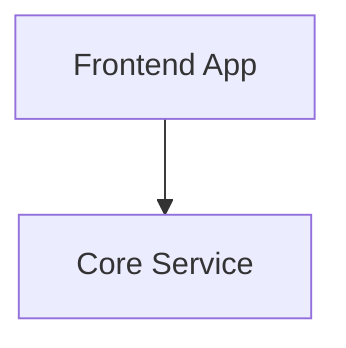

# Documentation System Plan

This document is the complete, resumable spec for GroundWork's documentation system — every doc type a finished project should have, where each doc lives, which skill produces it, and how the source material is staged in this repository.

It is written to survive a context reset. A fresh chat with zero prior context should be able to open this file and execute the next slice without further setup.

---

## 1. Resume Instructions (read this first if you are picking up)

If you are a new conversation arriving at this file, do the following in order:

1. **Read this entire document.** It is long but self-contained. Do not start work until you have read it end-to-end.
2. **All planning decisions are resolved.** §4 contains the locked-in decisions with rationale — do not re-open unless circumstances have materially changed. The progress tracker decisions log (§14) records resolution dates.
3. **Check the [Progress Tracker](#14-progress-tracker)** — find the lowest-numbered slice marked "Not started" or "In progress". The dependency graph in §13 governs order; do not jump ahead unless your slice has no upstream blockers.
4. **Read the relevant skill/CLI files** referenced in the [Cross-References](#16-cross-references) section before editing them. The repository has strong conventions; conform to them.
5. **For content adaptation work (Slice 1a/1b), read the [Adaptation Playbook](#7-adaptation-playbook)** — it defines the rules for converting wordloop source files into groundwork docs (MDX→MD, frontmatter, generalisation).
6. **Update the [Progress Tracker](#14-progress-tracker)** when you start a slice (mark "In progress" with date) and when you finish (mark "Done" with date). The tracker is the only place that records build state — keep it accurate.
7. **The wordloop source repository** at `/Users/ryannel/Workspace/wordloop-platform/services/wordloop-docs/content/docs/` is the material you adapt from. Do not invent content; adapt the originals.

---

## 2. Goal

When a project completes the GroundWork greenfield flow and ships its MVP bet, it should have a complete, living documentation system suitable for both human engineers and AI agents:

- Product brief grounding the vision
- Design system document
- Architecture overview with data flows
- Domain objects with lifecycle state machines
- Architectural decision records (ADRs)
- Engineering principles — a stack-agnostic manifesto plus section-by-section detail (foundations, quality, delivery, system design, AI-native)
- Language-specific principles for every language in the system
- Ways of working that describe how the team operates and ships using GroundWork

These documents are not frozen snapshots. They are living artefacts updated by every subsequent bet and validated by every phase. The Living Documents protocol defined in `src/hidden-skills/operating-contract.md` governs how they evolve.

Out of the current setup flow, only five of these exist (product brief, UX design, architecture, infrastructure, bet pitches). This plan extends the system to produce the rest.

---

## 3. Key Design Decisions

Each decision is recorded with its rationale. If you find yourself wanting to revisit one, surface the trade-off explicitly rather than silently changing direction.

### 3.1 Pre-canned content, not conversationally generated

**Decision:** Engineering principles, language principles, and ways-of-working docs are pre-written in this repository and deployed verbatim. They are not produced by a skill talking to the user.

**Rationale:** These documents are largely universal — they describe how good software is built, not what this specific product does. Generating them through conversation would be slow, costly in tokens, and inconsistent across projects. Pre-canning gives every project the same high-quality starting point. Projects can edit the docs after init; they are project-owned from that moment.

### 3.2 Two deployment paths: `init` vs generators

**Decision:** `npx groundwork init` deploys the universal docs (principles foundations, quality, delivery, system-design, ai-native, postgres, ways-of-working). Each Nx generator (go-microservice, python-microservice, nextjs-app) deploys its language-specific docs alongside the service code.

**Rationale:** Universal docs apply to every project regardless of stack and belong in `init`. Language docs only make sense if that language is in the system — coupling them to the generator means a project never receives Go principles unless it actually has a Go service. The same logic applies to adding a service mid-project: if a new Go service is generated later, the docs arrive with it.

### 3.3 Engineer skills remain standalone

**Decision:** `groundwork-go-engineer`, `groundwork-python-engineer`, and `groundwork-nextjs-engineer` carry their own knowledge. They do not read the project's `docs/principles/stack/<language>/` files at runtime.

**Rationale:** Skills are tuned, tested, and shipped as units. Coupling a skill's behaviour to a file the user can freely edit introduces a class of failure where the skill performs differently in different projects based on doc drift. The principles doc and the engineer skill must be kept in sync — but in the source repository, by us, in the same commit.

**Sync mechanism (in scope — Slice 1e):** Each engineer skill carries a `sync-anchor.md` file at `src/hidden-skills/<engineer-skill>/sync-anchor.md` listing every stack principle file it embeds knowledge from, plus the SHA-256 of that principle file at the time the skill was last updated. When any principle file changes, a CI check compares its current hash against the anchor; mismatches fail the build with a message identifying which skill needs review. This is a small concrete safety net rather than a deferred good intention.

### 3.4 Service-level docs are deferred (roadmap)

**Decision:** `docs/services/<service>/index.md`, `api.md`, and `database.md` are not built by this plan. A dedicated `groundwork-service-writer` skill is required and is not yet designed. Tracked as future work, not abandoned — the gap is real and will be addressed in a follow-up plan.

**Rationale:** Service docs need a tighter contract than the principles — they describe the actual API surface and database schema, which change every bet. Producing them well requires reading code, understanding contracts, and writing alongside bet planning. That is a real skill, not a copy operation. Deferring it lets the rest of this plan ship without that complexity.

### 3.5 Domain objects and ADRs are in scope

**Decision:** `docs/domain/<entity>.md` and `docs/decisions/NNNN-<slug>.md` are produced conversationally — domain stubs by the architecture skill (extended by bet planning), ADRs by the architecture skill (with bet validation adding new ones over time).

**Rationale:** These are project-specific and cannot be pre-canned, but they have stable formats and clear owning phases. They cost little to add to existing skills.

### 3.6 Ways-of-working describes the GroundWork methodology

**Decision:** The pre-canned `docs/ways-of-working/` docs describe how the GroundWork delivery loop works. They are the human-readable counterpart to `operating-contract.md` (which targets agents).

**Rationale:** Teams using GroundWork need a place to read about bets, slices, and the documentation protocol in plain language. The operating contract is too dense and agent-flavoured for that audience.

**Source of content:** The existing `docs/methodology/` files in *this* repository (core-concepts.md, units-of-work.md) become the canonical ways-of-working content via the migration recorded in §4.1.

### 3.7 Adding services mid-project = scaffold skill in narrow mode

**Decision:** When a bet introduces a new service, the existing scaffold skill is invoked with a narrow scope — generate this one service, deploy its principles, update `docs/infrastructure.md`. No new skill is needed.

**Rationale:** The full greenfield scaffold flow and adding-a-service share most of their logic. Splitting them creates duplication; parameterising the existing skill is cleaner. The narrow mode is not in scope for this plan but is unblocked by the work here (the principles deployment already triggers when the generator runs).

---

## 4. Decisions Record

All open questions raised during planning have been resolved. The resolutions below are binding for execution. Trade-offs are preserved for future revisitation if circumstances change.

### 4.1 Relationship with `docs/methodology/` — **Resolved: move to `src/docs/ways-of-working/`**

`docs/methodology/core-concepts.md` and `docs/methodology/units-of-work.md` already exist in this repository as framework documentation. They describe the same concepts the deployed ways-of-working docs need to cover. **Decision:** move them to `src/docs/ways-of-working/`. The `src/` prefix indicates "ships to users"; methodology content is the canonical material that does ship. The groundwork repo's framework documentation in the rest of `docs/` (lifecycle, product brief) is genuinely different — it describes the *framework*, not how to *use* the framework.

**Migration impact (handled in Slice 1c):**
- `docs/methodology/core-concepts.md` → `src/docs/ways-of-working/how-we-work.md`
- `docs/methodology/units-of-work.md` → `src/docs/ways-of-working/units-of-work.md`
- Remove empty `docs/methodology/` directory.
- Update `llms.txt` at repo root to reflect new paths.
- Update `.agents/skills/groundwork-contributor/SKILL.md` if it references `docs/methodology/`.
- Update any other internal links via grep.

### 4.2 Stack directory naming — **Resolved: language names**

Paths: `stack/go/`, `stack/python/`, `stack/typescript/`. Principles apply to the language broadly, not to a specific generator's output. Language names are stable; generator names may evolve.

### 4.3 Frontmatter shape for deployed docs — **Resolved: minimal**

Every deployed doc carries:

```yaml
---
title: <Document Title>
description: <One-line summary>
status: active
last_reviewed: 2026-05-25
---
```

`last_reviewed` is set to the date of adaptation. `groundwork-check` reads this field for staleness signals. Wordloop-specific fields (`audience`, `owner`, `review_frequency`, `source_of_truth`, `review_basis`) are dropped — projects can add their own governance metadata later if they choose.

### 4.4 Re-init idempotency for `docs/` — **Resolved: additive copy**

The current `init` flow wipes `.agents/skills/` and `.agents/groundwork/skills/` before copying. For `docs/`, this is wrong — users will have edited their docs and we must not overwrite them.

**Decision:** `init` must use additive copy for `docs/`. If a file already exists at the target path, skip it. If a file is missing, create it. Never overwrite. Print a one-line note per skipped file at verbose level only.

**Implementation:** Use a recursive walk with `fs.existsSync` check per file rather than `cp -R`. Pattern:

```js
function copyDocsIdempotent(srcDir, destDir) {
  for (const entry of fs.readdirSync(srcDir, { withFileTypes: true })) {
    const src = path.join(srcDir, entry.name);
    const dest = path.join(destDir, entry.name);
    if (entry.isDirectory()) {
      fs.mkdirSync(dest, { recursive: true });
      copyDocsIdempotent(src, dest);
    } else if (!fs.existsSync(dest)) {
      fs.copyFileSync(src, dest);
    }
  }
}
```

### 4.5 Re-run idempotency for generators

If a generator runs twice (two Go services, both wanting to deploy `docs/principles/stack/go/`), the second run must not overwrite the first. The principles doc is per-language, not per-service.

**Decision:** Each generator checks `tree.exists('docs/principles/stack/<language>/index.md')` before writing. If present, skip the principles deployment entirely. The first service to be generated establishes the principles; subsequent services share them.

### 4.6 `llms.txt` indexing — **Resolved: static, shipped, idempotent**

Ship a hand-curated `src/docs/llms.txt` that indexes every doc deployed by init. Deploy via the same idempotent copy as other docs — never overwrite a file the user has edited.

When a generator deploys stack-specific docs, it appends a line to the user's `llms.txt` (if present) under the appropriate section. Append-only: never rewrite existing lines, never deduplicate. If the user has restructured the file, the generator silently skips the append rather than fight the user's organisation.

---

## 5. Document Taxonomy

### 5.1 Produced by the greenfield setup flow (existing)

| Document | Path | Created by |
|---|---|---|
| Product brief | `docs/product-brief.md` | `groundwork-product-brief` |
| UX design / design system | `docs/ux-design.md` | `groundwork-ux-design` |
| Architecture overview | `docs/architecture.md` | `groundwork-architecture` |
| Infrastructure map | `docs/infrastructure.md` | `groundwork-scaffold` |
| Bet pitches and plans | `docs/bets/<slug>/` | `groundwork-mvp`, `groundwork-bet` |

### 5.2 Deployed on `npx groundwork init` (universal)

All sourced from wordloop unless noted. See [§6](#6-source-material--wordloop-mapping) for the file-by-file mapping.

| Document | Path |
|---|---|
| Engineering manifesto | `docs/principles/index.md` |
| Code craft | `docs/principles/foundations/code-craft.md` |
| Documentation principles | `docs/principles/foundations/documentation.md` |
| Testing principles | `docs/principles/foundations/testing.md` |
| Product engineering | `docs/principles/foundations/product-engineering.md` |
| Reliability | `docs/principles/quality/reliability.md` |
| Observability | `docs/principles/quality/observability.md` |
| Performance | `docs/principles/quality/performance.md` |
| Security | `docs/principles/quality/security.md` |
| Privacy | `docs/principles/quality/privacy.md` |
| Developer experience | `docs/principles/delivery/devex.md` |
| Progressive delivery | `docs/principles/delivery/progressive-delivery.md` |
| Platform | `docs/principles/delivery/platform.md` |
| Hexagonal architecture | `docs/principles/system-design/hexagonal-architecture.md` |
| API design | `docs/principles/system-design/api-design.md` |
| Integration patterns | `docs/principles/system-design/integration-patterns.md` |
| Real-time patterns | `docs/principles/system-design/real-time.md` |
| Data engineering | `docs/principles/system-design/data-engineering.md` |
| AI engineering | `docs/principles/ai-native/ai-engineering.md` |
| Agent-native systems | `docs/principles/ai-native/agent-native-systems.md` |
| Postgres | `docs/principles/stack/postgres.md` |
| How we work | `docs/ways-of-working/how-we-work.md` (from `docs/methodology/core-concepts.md`) |
| Units of work | `docs/ways-of-working/units-of-work.md` (from `docs/methodology/units-of-work.md`) |
| Documentation protocol | `docs/ways-of-working/documentation.md` (write fresh — see §10.3) |

### 5.3 Deployed by generators (stack-specific)

| Document | Path in user project | Generator |
|---|---|---|
| Go service conventions | `docs/principles/stack/go/index.md` | go-microservice |
| Go concurrency | `docs/principles/stack/go/concurrency.md` | go-microservice |
| Go testing | `docs/principles/stack/go/testing.md` | go-microservice |
| Python async patterns | `docs/principles/stack/python/async.md` | python-microservice |
| Python resilience | `docs/principles/stack/python/resilience.md` | python-microservice |
| Python testing | `docs/principles/stack/python/testing.md` | python-microservice |
| Python code documentation | `docs/principles/stack/python/documentation.md` | python-microservice |
| MCP servers | `docs/principles/stack/python/mcp.md` | python-microservice |
| Frontend principles | `docs/principles/stack/typescript/frontend.md` | nextjs-app |

### 5.4 Produced conversationally (existing skill changes)

| Document | Path | Created/updated by |
|---|---|---|
| Domain entity stubs | `docs/domain/<entity>.md` | `groundwork-architecture` (create) / `groundwork-bet` 02-planning (extend) |
| Architectural decisions | `docs/decisions/NNNN-<slug>.md` | `groundwork-architecture` (initial set) / `groundwork-bet` 04-validation (subsequent) |

### 5.5 Roadmap (out of scope for this plan)

| Document | Blocker |
|---|---|
| `docs/services/<service>/index.md` | Needs `groundwork-service-writer` skill |
| `docs/services/<service>/api.md` | Needs `groundwork-service-writer` skill |
| `docs/services/<service>/database.md` | Needs `groundwork-service-writer` skill |

These will be addressed in a follow-up plan once the work in this plan ships.

---

## 6. Source Material — Wordloop Mapping

All pre-canned principles docs are adapted from `/Users/ryannel/Workspace/wordloop-platform/services/wordloop-docs/content/docs/principles/`. The adaptation rules are in [§7](#7-adaptation-playbook).

### 6.1 Generic principles (init-deployed)

| Wordloop source | Groundwork target | Generalisation effort |
|---|---|---|
| `principles/index.mdx` | `src/docs/principles/index.md` | Light — strip Wordloop name |
| `principles/foundations/code-craft.mdx` | `src/docs/principles/foundations/code-craft.md` | None |
| `principles/foundations/documentation.mdx` | `src/docs/principles/foundations/documentation.md` | Light — strip wordloop-docs service refs |
| `principles/foundations/testing.mdx` | `src/docs/principles/foundations/testing.md` | None |
| `principles/foundations/product-engineering.mdx` | `src/docs/principles/foundations/product-engineering.md` | None |
| `principles/quality/reliability.mdx` | `src/docs/principles/quality/reliability.md` | None |
| `principles/quality/observability.mdx` | `src/docs/principles/quality/observability.md` | None |
| `principles/quality/performance.mdx` | `src/docs/principles/quality/performance.md` | None |
| `principles/quality/security.mdx` | `src/docs/principles/quality/security.md` | None |
| `principles/quality/privacy.mdx` | `src/docs/principles/quality/privacy.md` | None |
| `principles/delivery/devex.mdx` | `src/docs/principles/delivery/devex.md` | Medium — `./dev` references and wordloop-specific CLI tooling need generalising |
| `principles/delivery/progressive-delivery.mdx` | `src/docs/principles/delivery/progressive-delivery.md` | None |
| `principles/delivery/platform.mdx` | `src/docs/principles/delivery/platform.md` | None |
| `principles/system-design/hexagonal-architecture.mdx` | `src/docs/principles/system-design/hexagonal-architecture.md` | None |
| `principles/system-design/api-design.mdx` | `src/docs/principles/system-design/api-design.md` | None |
| `principles/system-design/integration-patterns.mdx` | `src/docs/principles/system-design/integration-patterns.md` | None |
| `principles/system-design/real-time.mdx` | `src/docs/principles/system-design/real-time.md` | None |
| `principles/system-design/data-engineering.mdx` | `src/docs/principles/system-design/data-engineering.md` | None |
| `principles/ai-native/ai-engineering.mdx` | `src/docs/principles/ai-native/ai-engineering.md` | None |
| `principles/ai-native/agent-native-systems.mdx` | `src/docs/principles/ai-native/agent-native-systems.md` | None |
| `principles/stack/postgres.mdx` | `src/docs/principles/stack/postgres.md` | None |

### 6.2 Stack-specific principles (generator-deployed)

| Wordloop source | Groundwork target | Generalisation effort |
|---|---|---|
| `principles/stack/go-services/index.mdx` | `src/generators/go-microservice/docs/principles/stack/go/index.md` | Light — remove wordloop-core references |
| `principles/stack/go-services/concurrency.mdx` | `src/generators/go-microservice/docs/principles/stack/go/concurrency.md` | None |
| `principles/stack/go-services/testing.mdx` | `src/generators/go-microservice/docs/principles/stack/go/testing.md` | None |
| `principles/stack/python/async.mdx` | `src/generators/python-microservice/docs/principles/stack/python/async.md` | Light — remove wordloop-ml references |
| `principles/stack/python/resilience.mdx` | `src/generators/python-microservice/docs/principles/stack/python/resilience.md` | None |
| `principles/stack/python/testing.mdx` | `src/generators/python-microservice/docs/principles/stack/python/testing.md` | None |
| `principles/stack/python/documentation.mdx` | `src/generators/python-microservice/docs/principles/stack/python/documentation.md` | None |
| `principles/stack/python/mcp.mdx` | `src/generators/python-microservice/docs/principles/stack/python/mcp.md` | None |
| `principles/stack/frontend.mdx` | `src/generators/nextjs-app/docs/principles/stack/typescript/frontend.md` | Light — remove wordloop-app references |

### 6.3 Adapted or written from scratch

| Document | Source | Notes |
|---|---|---|
| `src/docs/ways-of-working/how-we-work.md` | Move from `docs/methodology/core-concepts.md` (this repo) | Light generalisation: strip any wordloop references and remove any prose that assumes the reader is contributing to GroundWork itself rather than using it |
| `src/docs/ways-of-working/units-of-work.md` | Move from `docs/methodology/units-of-work.md` (this repo) | Light generalisation: the existing file contains an explicit wordloop-vocabulary aside ("'Milestone' and 'Slice' share surface similarity with Wordloop's vocabulary…") — rewrite that paragraph to drop the comparison; the original framing is internal to this repo and not appropriate for user-deployed material |
| `src/docs/ways-of-working/documentation.md` | New — write fresh | Content brief in §10.3 |
| `src/hidden-skills/templates/domain-entity.md` | New | Format defined in §10.1 |
| `src/hidden-skills/templates/adr.md` | New | Format defined in §10.2 |
| `src/hidden-skills/<engineer-skill>/sync-anchor.md` | New (3 files, one per engineer skill) | Format defined in §9.7 |

---

## 7. Adaptation Playbook

The wordloop docs are high-signal and well-written. Adaptation is mechanical, not creative. These rules ensure consistency across the ~20 files.

### 7.1 File format conversion: `.mdx` → `.md`

- Rename file extension from `.mdx` to `.md`.
- Remove all `import` statements at the top of the file (e.g. `import { Mermaid } from '@/components/Mermaid'`).
- Convert `<Mermaid chart={\`...\`} />` components to standard fenced mermaid code blocks:
  ```
  ```mermaid
  graph TB
    A --> B
  ```
  ```
- Convert MDX-only JSX components (`<Callout>`, custom React) to GitHub-flavoured equivalents (`> [!NOTE]`, blockquote, table).
- Preserve `> [!IMPORTANT]`, `> [!NOTE]`, `> [!WARNING]` as-is — these are CommonMark-compatible alerts.

### 7.2 Frontmatter shape

Each deployed doc carries this minimal frontmatter (per §4.3):

```yaml
---
title: <Document Title>
description: <One-line summary>
status: active
last_reviewed: 2026-05-25
---
```

`last_reviewed` is set to the date of the adaptation. The `groundwork-check` drift detector reads this field.

Drop these wordloop-specific fields entirely: `audience`, `owner`, `review_frequency`, `source_of_truth`, `review_basis`. Projects can add them back as their governance evolves.

### 7.3 Wordloop-specific reference removal

Search and replace patterns. Apply per file; verify nothing was missed by grepping the final output for "wordloop", "Wordloop", "WORDLOOP" — there should be zero matches in any `src/docs/` or `src/generators/*/docs/` file.

| Pattern in wordloop | Action |
|---|---|
| `Wordloop is a [platform / localized intelligence-first platform / ...]` | Generalise to "your platform" or rephrase to remove the subject |
| `wordloop-core`, `wordloop-ml`, `wordloop-app` | Replace with generic service-role descriptions ("the core service", "the ML service", "the frontend app") OR remove the specific example and keep only the principle |
| `./dev` (the wordloop CLI) | "your project's dev CLI" — note that GroundWork generates a `./dev` for the scaffold, so this may be retained if we document that convention |
| Clerk, AssemblyAI, specific vendor names | Remove specific vendor; describe the role generically ("auth provider", "speech API") |
| GCP Pub/Sub, Cloud Storage | Replace with "your messaging system" / "object storage" — unless the principle is genuinely cloud-specific, in which case keep but note the example status |
| Specific port numbers (4001, 4002, 4003) | Remove — these are wordloop allocations |
| Specific Wordloop directory paths | Remove or generalise |
| Internal links like `(../services/core/index.md)` | Remove the link entirely if the target does not exist in groundwork's output (most do not — services docs are out of scope) |

### 7.4 What to preserve

- Every technical stance and rationale
- All anti-patterns and "we reject X" lists
- Stack-specific patterns in stack docs (concrete library names, version stances, code shapes)
- Code samples — including framework-specific ones, since stack docs only deploy when that stack is chosen
- Mermaid diagrams (after MDX→MD conversion)

### 7.5 What to remove or rewrite

- "How to read this hub" sections that reference wordloop's docs structure
- Links to wordloop pages that won't exist in groundwork output
- "Owner: architecture" or "Owner: platform" governance — generic groundwork docs don't have a team ownership model
- Wordloop's specific review cadence calendar

### 7.6 Worked example: the adaptation pattern

Before (wordloop):
```markdown
---
title: System Architecture
audience: engineers
owner: architecture
last_reviewed: 2026-04-19
---
import { Mermaid } from '@/components/Mermaid'

# System Architecture Overview

Wordloop is a localized, intelligence-first platform structured so that each
service owns an isolated domain boundary.

## Topology
<Mermaid chart={`graph TB
    APP[wordloop-app] --> CORE[wordloop-core]`} />
```

After (groundwork, hypothetical — illustrating the rules):
```markdown
---
title: System Architecture
description: How services own domains and communicate via typed contracts.
status: active
last_reviewed: 2026-05-25
---

# System Architecture Overview

A well-structured platform isolates services so each owns a single domain
boundary, communicating only through strictly typed contracts.

## Topology


```

Apply this pattern across every file.

---

## 8. Source Repository Structure

```
src/
├── docs/                                  ← NEW. Ships in npm package. Deployed on init.
│   ├── llms.txt                           ← Static index of deployed docs
│   ├── principles/
│   │   ├── index.md                       ← Engineering manifesto
│   │   ├── foundations/
│   │   │   ├── code-craft.md
│   │   │   ├── documentation.md
│   │   │   ├── testing.md
│   │   │   └── product-engineering.md
│   │   ├── quality/
│   │   │   ├── reliability.md
│   │   │   ├── observability.md
│   │   │   ├── performance.md
│   │   │   ├── security.md
│   │   │   └── privacy.md
│   │   ├── delivery/
│   │   │   ├── devex.md
│   │   │   ├── progressive-delivery.md
│   │   │   └── platform.md
│   │   ├── system-design/
│   │   │   ├── hexagonal-architecture.md
│   │   │   ├── api-design.md
│   │   │   ├── integration-patterns.md
│   │   │   ├── real-time.md
│   │   │   └── data-engineering.md
│   │   ├── ai-native/
│   │   │   ├── ai-engineering.md
│   │   │   └── agent-native-systems.md
│   │   └── stack/
│   │       └── postgres.md
│   └── ways-of-working/
│       ├── how-we-work.md
│       ├── units-of-work.md
│       └── documentation.md
├── generators/
│   ├── go-microservice/
│   │   └── docs/principles/stack/go/      ← NEW. Deployed by generator.
│   │       ├── index.md
│   │       ├── concurrency.md
│   │       └── testing.md
│   ├── python-microservice/
│   │   └── docs/principles/stack/python/  ← NEW.
│   │       ├── async.md
│   │       ├── resilience.md
│   │       ├── testing.md
│   │       ├── documentation.md
│   │       └── mcp.md
│   └── nextjs-app/
│       └── docs/principles/stack/typescript/  ← NEW.
│           └── frontend.md
└── hidden-skills/
    └── templates/                         ← Existing dir.
        ├── discovery-notes.md             ← Existing.
        ├── domain-entity.md               ← NEW. Architecture/bet skills reference this.
        └── adr.md                         ← NEW. Architecture/bet skills reference this.
```

**npmignore:** `src/docs/` and `src/generators/*/docs/` must NOT be in `.npmignore` — they need to ship.

**Why `docs/` is a sibling to `files/` in generator directories:** The existing `files/` directory contains templated source (`.template` extension, variable substitution via `generateFiles`). The new `docs/` directory contains static, pre-finalised markdown — no variables, no substitution. Treating them as separate concerns matches their handling in the generator code: `files/` is processed by `generateFiles()`, `docs/` is walked manually and written via `tree.write()`.

---

## 9. Skill & CLI Changes Required

### 9.1 `bin/groundwork.js` — extend init with idempotent docs copy

Add a `copyDocsIdempotent` helper using the pattern from §4.4. Invoke it from `initGroundWork()` after the hidden skills copy step, before `setupAgentLinks()`. Source: `path.join(__dirname, '..', 'src', 'docs')`. Destination: `path.join(targetDir, 'docs')`.

Add a console line on success: `\x1b[32m✔\x1b[0m Installed documentation foundations`.

### 9.2 Generator updates (×3)

For each of `src/generators/go-microservice/generator.ts`, `src/generators/python-microservice/generator.ts`, `src/generators/nextjs-app/generator.ts`:

After the existing `generateFiles()` call, add a block that walks the generator's `docs/` directory and writes each file to the workspace root via `tree.write()`, **only if the file does not already exist in the tree**. Pattern (Go example):

```typescript
function deployStackDocs(tree: Tree, generatorDir: string, language: string) {
  const docsRoot = path.join(generatorDir, 'docs');
  if (!fs.existsSync(docsRoot)) return;

  function walk(src: string, relativePath: string) {
    for (const entry of fs.readdirSync(src, { withFileTypes: true })) {
      const srcPath = path.join(src, entry.name);
      const relPath = relativePath ? `${relativePath}/${entry.name}` : entry.name;
      if (entry.isDirectory()) {
        walk(srcPath, relPath);
      } else {
        if (!tree.exists(relPath)) {
          tree.write(relPath, fs.readFileSync(srcPath));
        }
      }
    }
  }
  walk(docsRoot, '');
}

// Inside the generator function, after generateFiles():
deployStackDocs(tree, __dirname, 'go');
```

The check on `tree.exists(relPath)` handles re-generation (a second Go service does not overwrite the principles).

### 9.3 `groundwork-architecture` skill

Modify `src/hidden-skills/groundwork-architecture/instructions.md`. Two responsibilities to add — in the phase where the architecture document is being drafted (look for the existing "draft architecture.md" phase).

**Domain entity extraction (new sub-phase):**

> After the architecture draft is approved, identify every core domain entity that surfaces in the system design — the nouns that services own. For each entity, write a stub to `docs/domain/<entity>.md` using the template at `.agents/groundwork/skills/templates/domain-entity.md`. The stub must contain: what the entity is, its core fields, its lifecycle states with transition triggers, the service that owns it, and the events it emits on state change. Stubs are explicitly incomplete — bet planning will extend them as the system grows.

**Architectural decision records (new sub-phase):**

> For each significant decision made during the architecture conversation — auth strategy, messaging pattern, database choice, communication patterns, ports between services — write an ADR to `docs/decisions/NNNN-<slug>.md` using the template at `.agents/groundwork/skills/templates/adr.md`. Number sequentially: read the existing `docs/decisions/` directory and use the next available integer (zero-padded to four digits). Each ADR must contain: context (what forced the decision), decision (what we chose), trade-offs (what we gave up, what risk we accepted). Status starts as `accepted`.

Both phases run before the existing commit step. Both follow the `groundwork-writer` enforcement (already required by the skill).

### 9.4 `groundwork-bet` — 02-planning workflow

Modify `src/hidden-skills/groundwork-bet/workflows/02-planning.md`. Add a step early in planning (after the pitch is read, before contracts are designed):

> Read `docs/domain/`. Identify whether this bet introduces any new domain entities or new lifecycle states on existing entities. If so, before contract design begins, create or update the relevant entity files using the template at `.agents/groundwork/skills/templates/domain-entity.md`. Confirm the updates with the user before proceeding. This is the Living Documents protocol applied to `docs/domain/`.

### 9.5 `groundwork-bet` — 04-validation workflow

Modify `src/hidden-skills/groundwork-bet/workflows/04-validation.md`. Add a step before the bet is closed:

> Review the technical decisions made during this bet. If any decision was significant enough to warrant a permanent record — a stance future bets should not relitigate without a new ADR — write an ADR to `docs/decisions/NNNN-<slug>.md` using the template at `.agents/groundwork/skills/templates/adr.md`. Significance test: would a new engineer joining the project six months from now need to know this decision to avoid revisiting it? If yes, record it. If no, skip. Not every bet produces an ADR.

### 9.6 `llms.txt` updates

The user project's `llms.txt` needs to index new docs deployed by init. Ship a static `src/docs/llms.txt` that lists every deployed doc with a one-line description. Deploy via the same idempotent copy as everything else in `src/docs/`.

(The groundwork repo's own `llms.txt` at the root is a separate file and unrelated.)

### 9.7 Engineer skill sync anchors

Each engineer skill (`groundwork-go-engineer`, `groundwork-python-engineer`, `groundwork-nextjs-engineer`) gets a `sync-anchor.md` file recording which stack principle files it embeds knowledge from, plus the SHA-256 of each principle at the time the skill was last reviewed.

Location: `src/hidden-skills/<engineer-skill>/sync-anchor.md`.

Format:

```markdown
# Sync Anchor

This file pins the principle files this skill embeds. When any listed file
changes, this skill must be reviewed in the same commit. CI verifies the
hashes match.

| Principle file | SHA-256 | Last reviewed |
|---|---|---|
| src/generators/go-microservice/docs/principles/stack/go/index.md | <hash> | 2026-05-25 |
| src/generators/go-microservice/docs/principles/stack/go/concurrency.md | <hash> | 2026-05-25 |
| src/generators/go-microservice/docs/principles/stack/go/testing.md | <hash> | 2026-05-25 |
```

CI check (added to `./dev test` and run on every commit touching `src/generators/*/docs/principles/`): walk every `sync-anchor.md`, recompute the SHA-256 of each referenced principle file, fail if any does not match. Failure message must name the engineer skill and the mismatched principle.

The check belongs in `./dev` rather than a GitHub Action because it must also work locally. Implementation: a small Python or bash script invoked by a new `./dev check sync-anchors` command, also called from existing CI.

### 9.8 `groundwork-check` integration with new doc types

`groundwork-check` is GroundWork's CI-side drift detector. It currently compares `docs/` against code state to flag stale content. The new doc types interact with it as follows:

| Doc type | What check does |
|---|---|
| `docs/principles/**`, `docs/ways-of-working/**` | These are project-stable and not derived from code. Check should NOT flag drift on them. It should, however, surface `last_reviewed` ages above a threshold (default: 12 months) as a low-severity advisory — not a build failure. |
| `docs/domain/<entity>.md` | Check should compare entity names against schema/migration files (when discoverable) and flag entities present in code but missing from docs, or vice versa. |
| `docs/decisions/NNNN-*.md` | No drift checks. ADRs are append-only historical records and never go stale. Check should verify numbering is sequential with no gaps and statuses are valid (`accepted` or `superseded by <link>`). |
| `docs/services/<service>/*` | Out of scope for this plan; check integration designed alongside `groundwork-service-writer`. |

`groundwork-check` skill instructions (`src/skills/groundwork-check/SKILL.md`) need a section added describing these behaviours. This is **Slice 4b**, added to the build plan below.

---

## 10. Document Templates & Content Briefs

### 10.1 Domain entity template (`src/hidden-skills/templates/domain-entity.md`)

```markdown
---
title: <Entity Name>
description: <One-line definition>
status: active
last_reviewed: <YYYY-MM-DD>
---

# <Entity Name>

**Owner:** <service-name>

## What it is

One paragraph describing the entity and its role in the system. State the
invariant the entity exists to enforce.

## Fields

| Field | Type | Description |
|---|---|---|
| id | uuid | Primary identifier. |
| ... | ... | ... |

## Lifecycle

States and what triggers each transition. If the entity has no meaningful
state machine (e.g. immutable record), say so explicitly and remove the
table.

| State | Triggered by | Description |
|---|---|---|
| draft | creation | Initial state on insert. |
| ... | ... | ... |

## Events emitted

Events published when state changes. Names use `<entity>.<verb>` convention.

| Event | Trigger | Payload summary |
|---|---|---|
| <entity>.created | initial insert | id, owner, created_at |
| ... | ... | ... |

## Invariants

Constraints that must hold for the entity to be valid. Listed explicitly so
that violations are detectable in tests and at boundaries.

- ...

## Notes

Anything non-obvious — historical decisions, edge cases, known gotchas.
```

### 10.2 ADR template (`src/hidden-skills/templates/adr.md`)

```markdown
---
title: <NNNN. Title>
description: <One-line summary of the decision>
status: accepted
last_reviewed: <YYYY-MM-DD>
---

# NNNN. <Title>

**Date:** <YYYY-MM-DD>
**Status:** accepted

> If this ADR is later superseded, change status to `superseded by [NNNN](NNNN-<slug>.md)`
> and add a note at the top of the body explaining what changed and why.

## Context

What problem or constraint forced this decision. What were we choosing
between. What are the forces at play.

## Decision

What we chose, stated as a single sentence followed by elaboration.

## Trade-offs

- **What we gave up:** ...
- **What risk we accepted:** ...
- **What this makes harder in future:** ...

## Alternatives considered

Other options on the table and why they were rejected.

- ...
```

### 10.3 Ways-of-working content briefs

These three files are deployed by init. The first two are adaptations of existing methodology docs (pending §4.1 decision). The third is written fresh.

**`docs/ways-of-working/how-we-work.md`** — adapt from `docs/methodology/core-concepts.md`.

Audience: humans joining a project that uses GroundWork. Length: one page. Covers:
- The two-mode lifecycle (Setup, Delivery Loop)
- What "Living Documents" means and why we do it
- Where the operating contract lives and what it governs (without reproducing it)
- A pointer to `units-of-work.md` for the delivery vocabulary
- A pointer to `documentation.md` for the documentation protocol

**`docs/ways-of-working/units-of-work.md`** — adapt from `docs/methodology/units-of-work.md`.

The existing file is already audience-appropriate. Light edits only — remove anything that breaks if framework-internal references disappear; keep the Bet/Milestone/Slice exposition intact. Reference: the existing file in this repo (already excellent content).

**`docs/ways-of-working/documentation.md`** — write fresh.

Audience: engineers and team leads. Purpose: the human-readable counterpart to `operating-contract.md`. Covers:
- The Living Documents protocol — what gets updated when, who is responsible. Frame this as "any phase, any bet, any direction" (the operating contract's framing).
- The document hierarchy: principles (project-owned, edit freely), ways-of-working (project-owned), architecture/product-brief/ux-design (updated via the relevant skill), domain/decisions (updated by bets), bets (immutable once committed).
- How `groundwork-check` works — what it detects, how to respond when it flags drift.
- The relationship between docs and skills — docs are for humans and project state; skills are how agents act on them.
- ADR conventions — when to write one (decisions a future engineer should not relitigate), how to supersede, how to number.

Length: one to two pages. Tone: declarative, no hedging. Apply `groundwork-writer` style.

---

## 11. llms.txt Indexing

A static `src/docs/llms.txt` ships with the universal docs and is deployed by init (idempotent — never overwrites user edits). It lists every doc deployed by `init` plus the conversationally-generated ones (so agents know to look for `docs/architecture.md` etc.).

Shape (illustrative — exact contents written during Slice 1):

```
# GroundWork Documentation Index

The canonical documents in this project, in their expected order of
relevance for AI agents working in this codebase.

## Vision and direction
- [Product Brief](docs/product-brief.md): The product's vision, users, and constraints.

## How we work
- [How we work](docs/ways-of-working/how-we-work.md): The two-mode lifecycle.
- [Units of work](docs/ways-of-working/units-of-work.md): Bet / Milestone / Slice.
- [Documentation protocol](docs/ways-of-working/documentation.md): The Living Documents protocol.

## Engineering principles
- [Manifesto](docs/principles/index.md): Eight core beliefs.
- [Foundations](docs/principles/foundations/): Code craft, documentation, testing, product engineering.
- [Quality](docs/principles/quality/): Reliability, observability, performance, security, privacy.
- ...

## System
- [Architecture](docs/architecture.md): Topology and communication patterns.
- [Infrastructure](docs/infrastructure.md): Boot order, ports, health checks.
- [Domain](docs/domain/): Entity definitions and lifecycles.
- [Decisions](docs/decisions/): Architectural decision records.
```

Stack-specific principles are added to `llms.txt` by the generator when it deploys them. Pattern: read the existing `llms.txt`, find the appropriate section, append a line. If `llms.txt` does not exist (a project that did not run `init` but did run a generator — rare but possible), skip.

---

## 12. Validation Criteria per Slice

Each slice has a clear "done" definition. Do not mark a slice complete in the tracker until its validation passes.

### Slice 1a — Universal principles adapted

- Every file listed in [§6.1](#61-generic-principles-init-deployed) exists in `src/docs/principles/` at the target path
- `grep -ri "wordloop" src/docs/` returns zero matches
- Every file has the minimal frontmatter from [§7.2](#72-frontmatter-shape)
- No `.mdx` extensions, no `import` lines, no JSX components remain in any file
- All `<Mermaid />` blocks are converted to fenced mermaid code blocks
- Spot-check three files manually for readability and tone

**Batching note:** ~21 files. If you are working with a human reviewer file-by-file, this slice may need to span multiple sessions. Suggested split if needed: `index.md` + `foundations/` in session 1 (5 files), `quality/` + `delivery/` in session 2 (8 files), `system-design/` + `ai-native/` + `stack/postgres.md` in session 3 (8 files). The progress tracker can be sub-bulleted to track this granularity if useful.

### Slice 1b — Stack principles adapted to generator dirs

- Every file listed in [§6.2](#62-stack-specific-principles-generator-deployed) exists at the target path
- `grep -ri "wordloop" src/generators/*/docs/` returns zero matches
- Frontmatter, MDX conversion, and generalisation rules all applied

### Slice 1c — Ways-of-working migrated and written

- `docs/methodology/` is removed from this repo (or replaced with a one-line README pointing to `src/docs/ways-of-working/`)
- Three files exist in `src/docs/ways-of-working/`: `how-we-work.md`, `units-of-work.md`, `documentation.md`
- `grep -ri "wordloop" src/docs/ways-of-working/` returns zero matches (the units-of-work paragraph called out in §6.3 has been rewritten)
- Root `llms.txt` updated to reflect the path migration
- `.agents/skills/groundwork-contributor/SKILL.md` updated if it referenced `docs/methodology/`
- A repo-wide grep for `docs/methodology` returns only references in this plan file (which are historical)

### Slice 1d — Templates written

- `src/hidden-skills/templates/domain-entity.md` exists matching §10.1
- `src/hidden-skills/templates/adr.md` exists matching §10.2

### Slice 1e — Engineer skill sync anchors

- `src/hidden-skills/groundwork-go-engineer/sync-anchor.md` exists listing the three Go principle files with SHA-256 hashes
- Same for `groundwork-python-engineer` (five files) and `groundwork-nextjs-engineer` (one file)
- A `./dev check sync-anchors` command exists and passes
- The check is wired into the relevant existing CI/test entrypoint (probably the same place `./dev test compilation` runs)

### Slice 2 — CLI init copies docs

- Running `npx groundwork init` in a fresh test directory creates `docs/principles/`, `docs/ways-of-working/`, and `llms.txt` (the llms.txt deploys at project root, not inside docs/)
- Re-running `init` after editing one of the deployed files does not overwrite the edit (idempotent)
- The existing scaffold eval still passes
- Smoke test (Slice 7c) asserts the doc tree matches §5.2 expectations

### Slice 3a/b/c — Generators deploy stack docs

- Generating a Go service writes `docs/principles/stack/go/` files at the workspace root
- Generating a second Go service does not overwrite the first set
- Same for Python and nextjs
- The compilation tests (`./dev test compilation`) still pass — adding doc files must not break generator output

### Slice 4 — Architecture skill writes domain stubs + ADRs

- The architecture eval scenario produces `docs/domain/<entity>.md` files and at least one `docs/decisions/0001-*.md` file
- Update the eval's `success_files` to include these
- Manual review: the domain stubs are structurally correct and reasonably accurate for the eval persona's product
- The ADRs cover real decisions from the conversation (not invented)

### Slice 5a — Bet planning extends domain docs

- A bet eval that introduces a new entity produces an update to `docs/domain/<entity>.md`
- The Living Documents protocol commit step is observed in the transcript

### Slice 5b — Bet validation writes ADRs when warranted

- An eval scenario designed to provoke a technical decision produces an ADR
- A control scenario without a decision does not produce one (no spurious ADRs)

### Slice 4b — `groundwork-check` integration

- `src/skills/groundwork-check/SKILL.md` updated with the new doc-type behaviours from §9.8
- Check correctly distinguishes between drift-checked docs (`domain/`), append-only docs (`decisions/`), and project-stable docs (`principles/`, `ways-of-working/`)
- Manual verification: trigger each category and observe correct behaviour

### Slice 7a/b/c — Evals and smoke tests

- `tests/evals/scenarios/<suite>/03_architecture.json` includes domain and decisions files in `success_files`
- Scaffold eval scenarios verify generator doc deployment
- A full suite run (`./dev eval run <suite>`) completes with all expected files
- **Slice 7c init smoke test:** A new test (likely `tests/scaffolds/test_init.py` or a new entry in an existing harness) runs `npx groundwork init` in a fresh temp directory and asserts the tree matches the expected shape: every path in §5.2 exists with non-empty content, `llms.txt` exists at project root, re-running init does not modify timestamps of existing files. Passing criterion: the test runs in under 30 seconds and exits 0.

---

## 13. Build Plan

Dependency graph:

```
Slice 1a (universal principles)        ┐
Slice 1b (stack principles)            │  all parallel
Slice 1c (ways-of-working migration)   │
Slice 1d (templates)                   ┘
       ↓
Slice 1e (sync anchors)                ← depends on 1b
       ↓
Slice 2 (CLI init copy)                ← depends on 1a, 1c
Slices 3a/3b/3c (generator updates)    ← depends on 1b, parallel with 2
Slice 4  (architecture skill)          ← depends on 1d
Slice 4b (groundwork-check update)     ← parallel with 4
       ↓
Slices 5a/5b (bet workflow updates)    ← depend on 1d
       ↓
Slices 7a/7b/7c (evals + smoke test)   ← depends on 2, 3, 4, 5

Slice 6 (service docs) — roadmap, not in this plan
```

**Suggested batching:**

- Session 1: Slice 1a — universal principles. ~21 files, mechanical but may need splitting (see Slice 1a validation criteria for the suggested split).
- Session 2: Slice 1b — stack principles into generator dirs. ~9 files.
- Session 3: Slices 1c, 1d, 1e. Lower volume but more thinking — ways-of-working migration, templates, sync anchors.
- Session 4: Slice 2 — CLI idempotent copy logic plus Slice 7c smoke test.
- Session 5: Slices 3a/3b/3c — generator updates (mostly identical work three times).
- Session 6: Slice 4 — architecture skill update. Highest judgment in this plan.
- Session 7: Slice 4b — `groundwork-check` integration.
- Session 8: Slices 5a/5b — bet workflow updates.
- Session 9: Slices 7a/7b — eval updates and a full eval run.

---

## 14. Progress Tracker

Update this table when you start and finish a slice. Format: `Not started` → `In progress (YYYY-MM-DD)` → `Done (YYYY-MM-DD)`.

| Slice | Description | Status |
|---|---|---|
| 1a | Adapt wordloop universal principles → `src/docs/principles/` (~21 files) | Not started |
| 1b | Adapt wordloop stack docs → generator `docs/` dirs (Go, Python, TypeScript; 9 files total) | Not started |
| 1c | Migrate `docs/methodology/` → `src/docs/ways-of-working/` and write `documentation.md` (3 files total) | Not started |
| 1d | Write `src/hidden-skills/templates/domain-entity.md` and `adr.md` | Not started |
| 1e | Write engineer skill `sync-anchor.md` files (3 files) and `./dev check sync-anchors` command | Not started |
| 2 | Update `bin/groundwork.js` for idempotent docs copy on init; ship `src/docs/llms.txt` | Not started |
| 3a | Update `go-microservice` generator to deploy stack docs (with idempotency check) | Not started |
| 3b | Update `python-microservice` generator to deploy stack docs (with idempotency check) | Not started |
| 3c | Update `nextjs-app` generator to deploy stack docs (with idempotency check) | Not started |
| 4 | Update `groundwork-architecture` skill — domain stubs + ADRs | Not started |
| 4b | Update `groundwork-check` skill — new doc-type behaviours from §9.8 | Not started |
| 5a | Update `groundwork-bet/02-planning.md` — domain doc updates | Not started |
| 5b | Update `groundwork-bet/04-validation.md` — ADR creation | Not started |
| 6 | Service-level docs (api, database, service index) | Roadmap (out of scope for this plan) |
| 7a | Update architecture eval `success_files` for domain + ADR files | Not started |
| 7b | Update scaffold eval coverage for principles deployment | Not started |
| 7c | Add `init` smoke test asserting deployed doc files | Not started |

**Decisions log:**

| Decision | Resolution | Date |
|---|---|---|
| §4.1 methodology vs ways-of-working relationship | Resolved: move `docs/methodology/` content to `src/docs/ways-of-working/` | 2026-05-25 |
| §4.2 stack directory naming | Resolved: language names (`stack/go/`, `stack/python/`, `stack/typescript/`) | 2026-05-25 |
| §4.3 frontmatter strategy | Resolved: minimal (`title`, `description`, `status`, `last_reviewed`) | 2026-05-25 |
| §4.4 re-init idempotency for docs | Resolved: additive copy, never overwrite | 2026-05-25 |
| §4.5 re-run idempotency for generators | Resolved: `tree.exists()` check before write | 2026-05-25 |
| §4.6 `llms.txt` strategy | Resolved: static `src/docs/llms.txt`, idempotent copy, generators append on stack deploy | 2026-05-25 |

---

## 15. Where to Start Next

All §4 decisions are resolved (see decisions log). The plan is execution-ready. Start with **Slice 1a** — the universal principles adaptation.

Suggested first session structure (engineering manifesto + foundations):

1. Open `/Users/ryannel/Workspace/wordloop-platform/services/wordloop-docs/content/docs/principles/index.mdx`.
2. Read it end to end.
3. Apply the Adaptation Playbook (§7) — strip Wordloop references, set the minimal frontmatter from §4.3, convert MDX to plain Markdown, save to `src/docs/principles/index.md`.
4. Repeat for `foundations/code-craft.mdx`, `foundations/documentation.mdx`, `foundations/testing.mdx`, `foundations/product-engineering.mdx`.
5. After five files are done, pause and re-read them as a coherent set. Verify the tone is consistent and the "we" voice doesn't reference anything wordloop-specific. Adjust if not.
6. Update the tracker (Slice 1a → "In progress" with date).
7. Continue through quality, delivery, system-design, ai-native, stack/postgres in subsequent sessions per the §13 batching.
8. When all ~21 files are done, mark Slice 1a "Done", commit, move on to Slice 1b.

If working solo (without a user reviewing file-by-file), Slice 1a may fit in one focused session. If reviewing each file with a human, plan for the three-session split described in the Slice 1a validation criteria.

---

## 16. Cross-References

Files in this repository that are touched or referenced by this plan. Read these before editing.

### Skills and instructions

- `src/hidden-skills/groundwork-architecture/instructions.md` — modified in Slice 4
- `src/hidden-skills/groundwork-bet/workflows/02-planning.md` — modified in Slice 5a
- `src/hidden-skills/groundwork-bet/workflows/04-validation.md` — modified in Slice 5b
- `src/hidden-skills/groundwork-scaffold/instructions.md` — referenced in §3.7 for future narrow-mode work
- `src/hidden-skills/operating-contract.md` — the agent-facing counterpart to ways-of-working
- `src/hidden-skills/templates/discovery-notes.md` — existing template (pattern to follow for new templates)

### CLI and generators

- `bin/groundwork.js` — modified in Slice 2 (init flow at lines ~100–185)
- `src/generators/go-microservice/generator.ts` — modified in Slice 3a
- `src/generators/python-microservice/generator.ts` — modified in Slice 3b
- `src/generators/nextjs-app/generator.ts` — modified in Slice 3c
- `generators.json` — referenced; no changes expected

### Existing docs in this repo

- `docs/methodology/core-concepts.md` — source for `ways-of-working/how-we-work.md`
- `docs/methodology/units-of-work.md` — source for `ways-of-working/units-of-work.md`
- `docs/lifecycle/01-setup.md`, `02-delivery-loop.md`, `03-maintenance.md` — framework docs, not deployed; cross-reference only
- `docs/product-brief.md` — groundwork's own product brief (not deployed)
- `llms.txt` — repo root, indexes this repo's docs (separate from the user-project llms.txt)
- `CLAUDE.md` — repo orientation, references `.agents/skills/groundwork-contributor/`
- `.agents/skills/groundwork-contributor/SKILL.md` — orientation skill, will need an update if the §4.1 methodology move happens

### Tests and evals

- `tests/evals/scenarios/<suite>/03_architecture.json` — `success_files` updated in Slice 7a
- `tests/evals/scenarios/<suite>/04_scaffold.json` — coverage extended in Slice 7b
- `tests/scaffolds/test_generation.py` — verify generator doc output structurally
- `tests/scaffolds/test_compilation.py` — must still pass after generator changes

### Source documentation (wordloop)

- `/Users/ryannel/Workspace/wordloop-platform/services/wordloop-docs/content/docs/principles/` — all adapted material lives here

---

## 17. Glossary

- **Slice** — A self-contained unit of build work in this plan (Slice 1a, 1b, etc.). Not to be confused with the GroundWork delivery concept of Slice (a vertical cut through a single tech stack component). Both meanings appear in this codebase; context disambiguates.
- **Pre-canned doc** — A doc that is written once in this repository and deployed verbatim to user projects. Distinguished from conversationally-generated docs that are produced by a skill talking to the user.
- **Living Documents** — The protocol defined in `operating-contract.md` for keeping `docs/` aligned with the system as it evolves. Any phase or bet may update any upstream document when new information surfaces.
- **Stack-specific** — Pertaining to one language or framework, deployed only when that language enters the project (via a generator). Contrasted with universal docs deployed on init regardless of stack.
