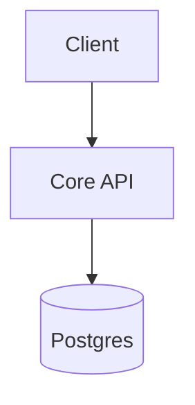
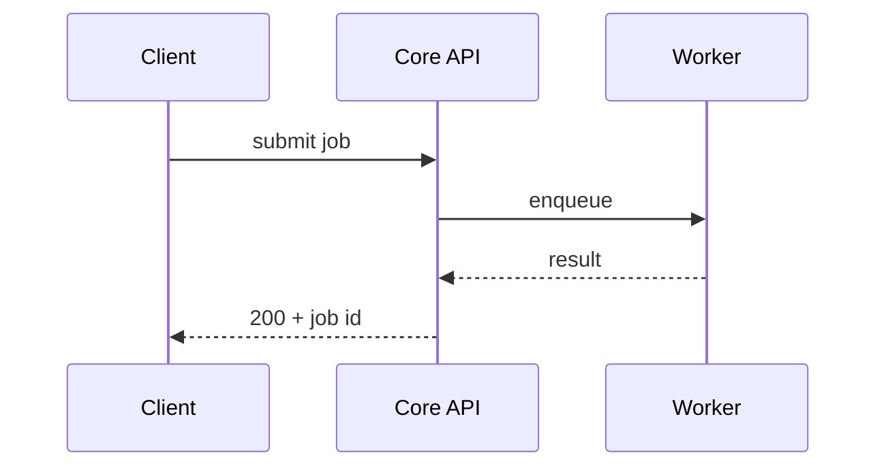

# Architecture Foundation

This document defines the physical and logical boundaries of the system required to deliver the MVP.

Every section below is **hand-kept**: rulings and design intent a human decided, which no tool can derive from code. Inventory the code can answer for itself — the service and module tables, the contract-location index — is **generated** into sibling files under `docs/architecture/generated/` by `npx groundwork-method generate-views`, first run at Setup Graduation. Each section's marker line names which it is, so a later editor knows whether they are writing a decision or copying a listing that regenerates without them.

## 1. Constraints & Budgets

*Hand-kept ruling.* The constraints that eliminate options before design begins, and the budgets later work is measured against.

## 2. Top-Level Topology

*Hand-kept design intent.* In greenfield this is prescriptive — the scaffold builds from it before any code exists. In brownfield it records what code alone cannot show: a compose-only service, a broker nothing imports, a service still planned. The service listing it implies is generated to `docs/architecture/generated/services.md`; restating that listing here creates a second record that drifts.

A `graph` diagram is **required** here — it is the reader's first mental model of the system. Show every service and the external dependencies (datastores, brokers, third-party APIs) and the connections between them; label each edge with what flows along it. The prose names what each node owns; the diagram carries the shape.

## 3. Key Capabilities & Technical Decisions

*Hand-kept ruling.* Each capability decision with the rationale and the downstream obligations it imposes.

### Capability Ports & Providers

Each technical capability the system depends on — LLM inference, a relational or vector store, messaging, telemetry, object storage, email, payments — is an **interface** the system depends on, satisfied by exactly one chosen **provider**: the implementation that fulfils it, wired in at the edge and swappable. Record the capability, the provider, and the provider's **operational footprint** (exactly one of `env` · `compose-service` · `runner` · `none`), with a one-line rationale. `none` is a first-class choice: a **bare interface** — the capability plus a failing contract test, no provider yet — to be built later as a bet. There are no default providers; infrastructure (a database, a tracing backend) appears *because* a provider's footprint requires it, never as a guess.

> Distinct from the **capability ledger** in `docs/surfaces.md`, which tracks user-facing *features* across surfaces. This table is about *technical capabilities* and the providers that satisfy them.

| Capability | Provider | Footprint | Rationale |
|---|---|---|---|

## 4. Component Boundaries & Contracts

*Hand-kept ruling.* What each component owns, what it explicitly does not, and the contract format each boundary publishes. Where those contract files sit on disk is generated to `docs/architecture/generated/contracts.md`, and the module and package inventory behind the components to `docs/architecture/generated/modules.md`.

## 5. Communication & Integration Patterns

*Hand-kept design intent.* The flows and their failure modes are decisions, not observations: greenfield builds from them, and in brownfield they carry the intent behind a path the code shows only as calls — why a hop is synchronous, which broker an event chain is meant to cross, an async path still planned.

For each non-trivial flow across services — a request that fans out, an event chain, an async path — draw a `sequenceDiagram` so timing and ordering are legible. The prose explains the failure modes and the design decisions the diagram cannot show. Skip trivial single-hop calls.

## 6. Service-Level Requirements

*Hand-kept ruling.* Each obligation with the service that owns it.

| Requirement | Originates From | Applies To |
|---|---|---|

## 7. Surfaces & Capability Core

*Hand-kept ruling.* The core's deployment stance, and per surface its access path and auth model — decisions the scaffold and the surface registry read.
