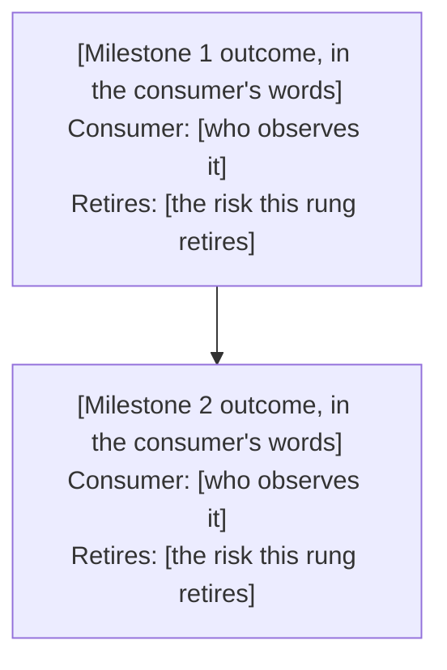

# The Milestone Ladder

*This is the landing page for the decomposition tree. It renders to
`docs/bets/<bet-slug>/decomposition/index.md` — the ladder at a glance, the diagram the
sequencing review at Step 2 was judged from. Keep it current: whenever a milestone is added,
reordered, or amended (`workflows/03-decomposition.md`'s amendment protocol), update this page
in the same commit. It is a landing page, not a second decomposition — the milestone `index.md`
files below hold the sequencing rationale, acceptance criteria, and Proof of work; this page
only orients.*

*(One node per milestone, in build order, edges matching that order. Each node names the
milestone's outcome the way its `index.md` names it — the product state its consumer reaches,
never a coined codename — plus who that consumer is and the risk the rung retires. Add a node
and an edge for every rung the ladder holds.)*

## Rungs

*One line per rung, in build order, each linking to its milestone folder: the milestone's
demonstrable-goal text, copied from its `index.md`, and its current status — derived from the
suite, never hand-ticked.*

- [**Milestone 1: [outcome]**](./01-<milestone-slug>/) — [demonstrable-goal text] — *[status]*
- [**Milestone 2: [outcome]**](./02-<milestone-slug>/) — [demonstrable-goal text] — *[status]*
