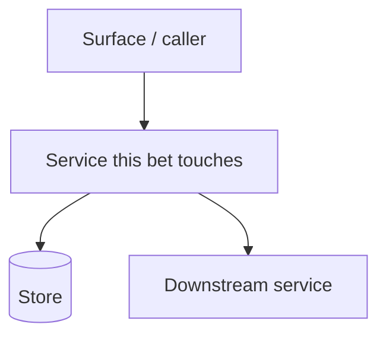
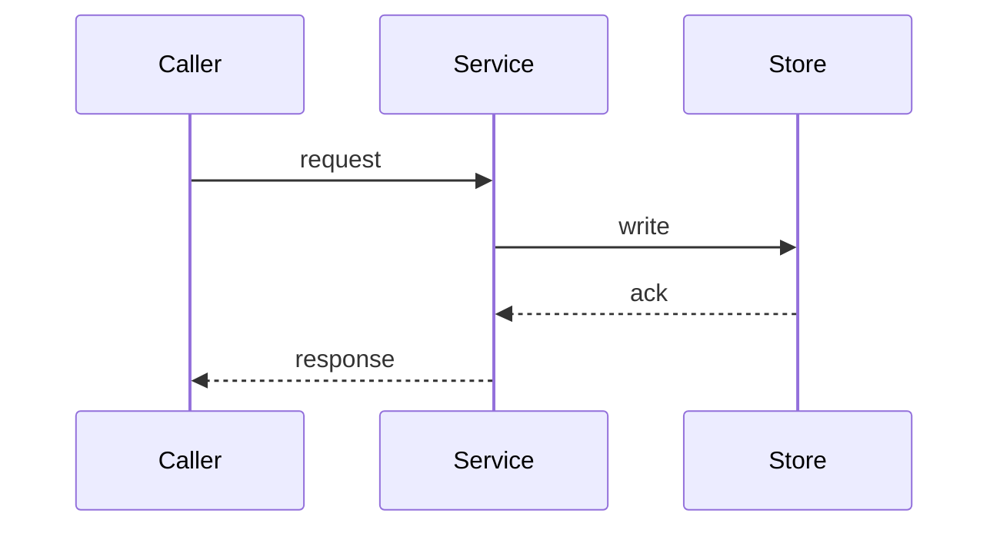

# Technical Design — Overview: [Bet Name]

*This is the orientation a reader gets first: the bet's business logic and key data flows, in prose, with diagrams. It frames the whole bet before anyone reads the surface or capability sections. One file that talks through the high-level business logic and dataflows is the most valuable artifact in this directory — write it for a reader who knows the product but not this bet.*

*This file absorbs the Data Flows narrative: the key data paths this bet introduces or changes, what triggers each, which services handle it, what persists, and the design decisions that shaped it. Skip trivial CRUD; focus on paths where timing, service boundaries, or failure modes are non-obvious.*

---

## What this bet does

*A few paragraphs of prose. What business capability does this bet deliver, and how does it work at the level of services and responsibilities? What changes in the system's behaviour when this bet ships? Reason about the design — explain why the shape is what it is — rather than enumerating endpoints.*

## Topology

*The services and components this bet touches and how they relate. A `graph` is required — a reader should be able to see the moving parts and their connections without reading prose. Renders on GitHub and the Fumadocs site.*

## Key data flows

*One subsection per significant data path. For each non-trivial cross-service or data flow, a `sequenceDiagram` is required — it makes timing, ordering, and service boundaries legible in a way prose cannot. Trivial CRUD needs no diagram; if a flow has no non-obvious timing, ordering, or failure mode, it does not belong here.*

### [Flow Name]

**Trigger:** [what initiates this flow — user action, scheduled job, upstream event]

**What persists:** [what is written and where, at the end of this flow]

**Key decisions:** [what design choices shape this flow and why — sync vs async, cache strategy, fallback behaviour, consistency model]

---
*(Add a `### [Flow Name]` block with its own `sequenceDiagram` for each significant, non-trivial data path in the bet.)*
