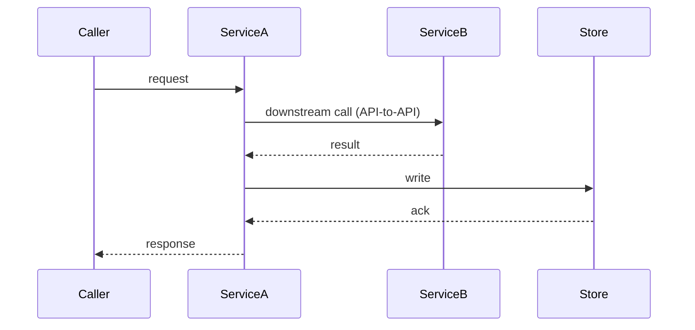

## Data Flows & Business Logic

*How the bet actually works: how data moves through the system, the business logic that governs it, and the routing decisions along the way. The service topology this bet plays in lives in the pitch's Solution — this file does not redraw it; it details how data flows across it. This is the most valuable file in the directory for a reader who knows the product but not this bet — it is where timing, ordering, service boundaries, and failure handling become legible.*

*Diagram-heavy by design. Every non-trivial flow carries a `sequenceDiagram` (these render on GitHub and the Fumadocs site) — prose alone cannot make ordering and cross-service timing legible. Skip trivial CRUD; a flow with no non-obvious timing, ordering, routing, or failure mode does not belong here.*

---

### [Flow Name]

**Trigger:** [what initiates this flow — a user action, a scheduled job, an upstream event]

**What persists:** [what is written and where, at the end of this flow]

**Business logic & routing:** [the rules that govern this flow — validation, branching, the routing/decision points (which path a request takes and why), idempotency, and any cross-service or API-to-API calls it makes. State the decisions, not just the path.]

**Key decisions:** [the design choices that shape this flow and why — sync vs async, cache strategy, fallback behaviour, consistency model]

*Where a flow's logic is a branch or decision rather than a sequence, a `flowchart` is the right diagram — show the routing decision and each path's outcome.*

---
*(Add a `### [Flow Name]` block with its own diagram for each significant, non-trivial data path or piece of business logic in the bet.)*
