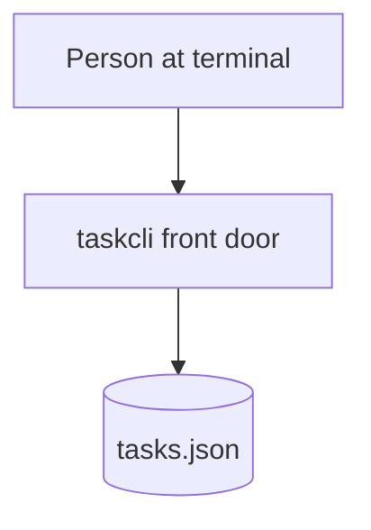

# Bet: Task Capture

## The Pitch

- **Problem:** There is no way to jot a task and see it again. A person at the terminal needs to capture a task in one command and list what they have captured.
- **Appetite:** Small — a couple of days. Worth it as the first vertical slice of the task manager; everything else builds on a working capture-and-list loop.
- **Stakes:** Low blast radius (a single local CLI, one JSON file), fully reversible (delete the file), light review load (a few pure functions and a thin front door). The risk that earns rigour is the store's persistence shape — get the record wrong and every later bet inherits it.
- **Solution:** A `taskcli` command with `add` and `list` subcommands over a tiny file-backed store. A follow-on milestone adds `done` to mark a task complete.
- **Success Signal:** A person runs `taskcli add "Buy milk"`, then `taskcli list`, and sees their task on screen — driven through the real CLI against a real file.

### Topology

## Rabbit Holes & No-Gos

**Rabbit Holes**

- [ ] Risk: the persisted record shape leaks into every later feature — Guard: the data design fixes the `Task` shape (id, title, done) up front; slices trace to it, none invent their own.

**No-Gos**

- [ ] No editing or deleting tasks in this bet — capture, list, and complete only; edit/delete is a later bet.
- [ ] No multi-user or sync — one local file, one user. Users will expect sharing eventually; explicitly out of scope here.
